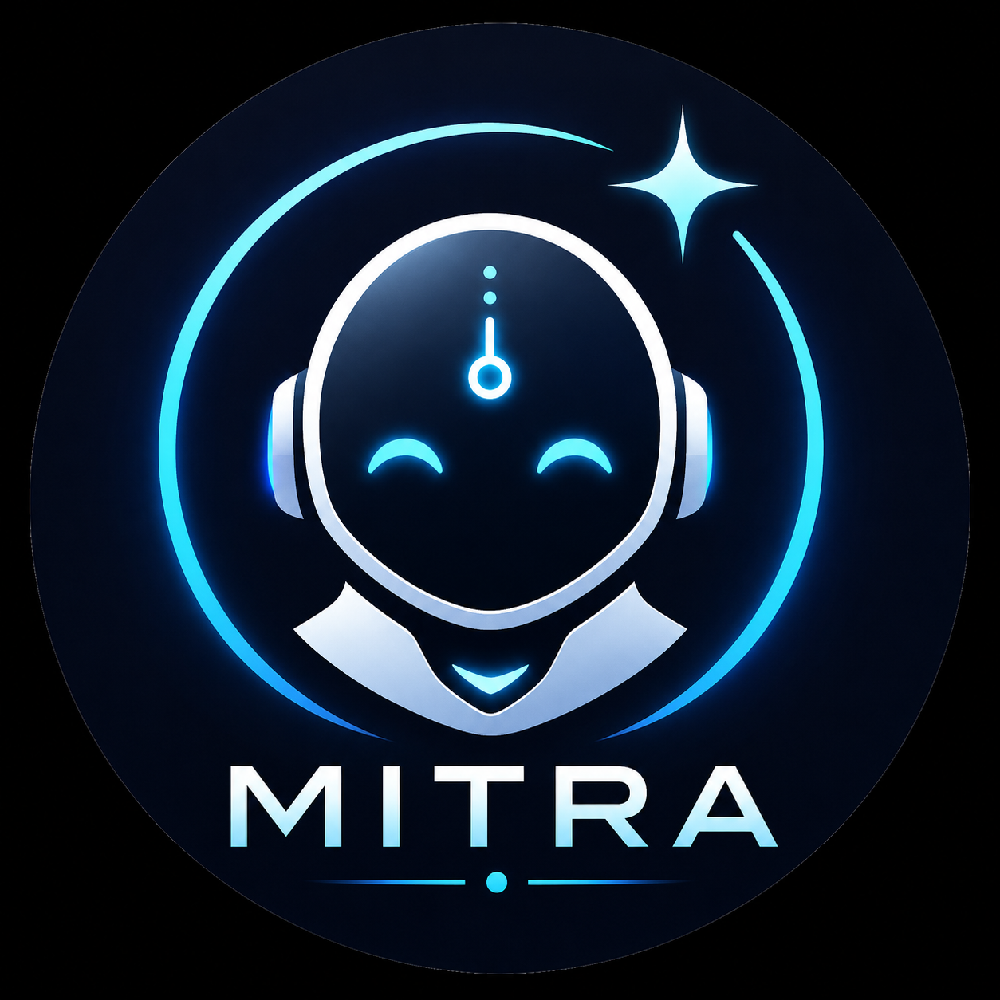

<h1 align="center">
  
  <br>
  Mitra - AI Virtual Assistant
</h1>
 A full-stack AI Virtual Assistant built with the MERN Stack and Google Gemini API. Create your own personalized AI assistant, customize its appearance, and interact with it using voice commands for an intelligent and interactive experience.

---

## 📖 Overview

AI Virtual Assistant is a full-stack web application that allows users to create a personalized AI assistant by selecting a predefined avatar or uploading a custom one, assigning a unique name and gender, and interacting with it through voice commands.

The assistant is powered by the **Google Gemini API**, enabling natural conversations and browser-based automation. It can answer questions, perform web searches, open popular websites, and execute various voice-controlled tasks.

---


## 🔐 Authentication

- User Registration
- User Login
- Secure JWT Authentication
- Access Token & Refresh Token
- HTTP-Only Cookies
- Protected Routes
- Logout

---

## 👤 Assistant Customization

- Choose from built-in avatars
- Upload a custom avatar
- Edit avatar anytime
- Set assistant name
- Select assistant gender
- Personalized assistant profile

---

## 🤖 AI Capabilities

- Powered by Google Gemini API
- Intelligent conversations
- Context-aware responses
- Answers general knowledge questions
- Explains programming concepts


---


## 🗣 Voice Commands

- Activate assistant using its name
- Voice-based interaction
- Search the web
- Open websites
- Answer questions
- Tell current time
- Tell current date
- Tell current day
- Tell current month

---

# 🛠 Tech Stack

## Frontend

- React.js
- Vite
- Tailwind CSS
- React Router DOM
- Axios
- React Icons


## Backend

- Node.js
- Express.js
- MongoDB
- Mongoose
- JWT Authentication
- BcryptJS
- Cookie Parser
- Multer
- Cloudinary
- Dotenv
- CORS
- Moment.js

## Database


## Artificial Intelligence

- Google Gemini API


##  Security Features

- Password Hashing (BcryptJS)
- JWT Authentication
- Refresh Token Rotation
- HTTP-Only Cookies
- Secure Cookies
- Protected Routes
- Environment Variables
- Cloud Image Storage


---

## Development Tools

- Git
- GitHub
- VS Code
- Postman
- MongoDB Atlas

---


# 📌 Future Improvements


- Reminder System
- Histroy section
- Weather Information
- News Updates
- Desktop Application (Electron)
- Mobile Application
- Multi-language Support


---

# 📁 Project Structure

```
AI-Virtual-Assistant
│
├── backend
│   ├── controllers
│   ├── middleware
│   ├── models
│   ├── routes
│   ├── utils
│   ├── public
│   ├── app.js
│   ├── index.js
│   └── package.json
│
├── frontend
│   ├── src
│   │   ├── Components
│   │   ├── Context
│   │   ├── Pages
│   │   ├── assets
│   │   └── App.jsx
│   │
│   └── package.json
│
└── README.md
```

---

# 🚀 Getting Started

## 1️⃣ Clone Repository

```bash
git clone https://github.com/AkashMondal27/AI-Virtual-Assistant.git
```

---

## 2️⃣ Navigate to Project

```bash
cd AI-Virtual-Assistant
```

---

## 3️⃣ Backend Setup

```bash
cd backend
npm install
```

Create a `.env` file

```env
PORT=

MONGODB_URL=

ACCESS_TOKEN_SECRET=

ACCESS_TOKEN_EXPIRY=

REFRESH_TOKEN_SECRET=

REFRESH_TOKEN_EXPIRY=

CLOUDINARY_CLOUD_NAME=

CLOUDINARY_API_KEY=

CLOUDINARY_API_SECRET=

GEMINI_API_KEY=
```

Run Backend

```bash
npm run dev
```

---

## 4️⃣ Frontend Setup

```bash
cd frontend
npm install
npm run dev
```


---

# 👨‍💻 Author

## Akash Mondal

**Computer Science & Engineering Student**

### 🌐 Connect with Me

- 💻 GitHub: https://github.com/AkashMondal27
- 💼 LinkedIn: https://www.linkedin.com/in/akashmondal27/
- 📧 Email: akashmondal102003@gmail.com

---


# ⭐ Support

If you found this project useful, consider giving it a ⭐ on GitHub.

It motivates me to build more open-source projects and improve this one further.
